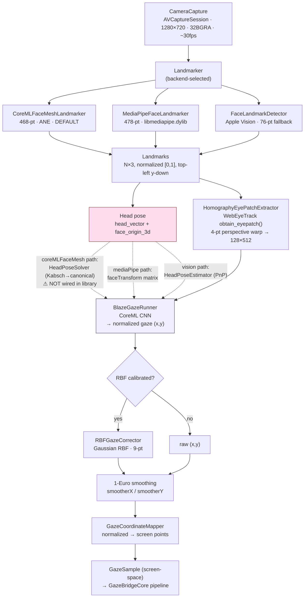
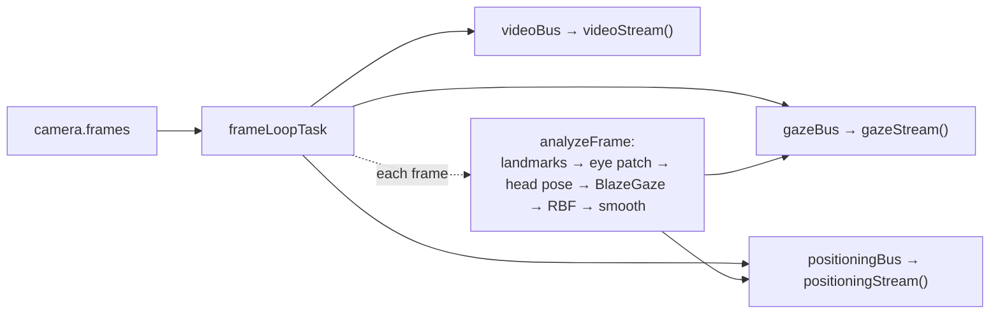

# MacGaze — Architecture

> Software eye tracking for macOS, using only the built-in FaceTime HD camera.
> This document describes the **current code as it stands today** (not the
> original phased plan). Last updated 2026-07-01.

MacGaze is a Swift package that conforms to GazeBridge's `TrackerDriver`
protocol. The GazeBridge menu-bar app loads it as an alternative to the
hardware eyetuitive driver — same UI, same pipeline, no external device.

## TL;DR

- **Landmarks** from the camera → **homography eye-patch** → **BlazeGaze CNN**
  → **RBF personalisation** → screen point.
- Three landmark backends exist (`coreMLFaceMesh` / `mediaPipe` / `vision`).
  **`coreMLFaceMesh` is the default** (Apple Silicon ANE, no Python dylib).
- The full validated pipeline lives in the **`macgaze-control` CLI**. The GUI
  library (`MacGazeTracker`) is **missing one wiring step** on the CoreML path
  — it doesn't feed head pose into BlazeGaze. See
  [§ Known divergence](#known-divergence--cli-vs-library).

## Pipeline (one frame)

## Components

### Capture — `Sources/MacGaze/Capture/`
- **`CameraCapture`** — `AVCaptureSession` on a dedicated queue, 1280×720 32BGRA
  from the front camera. Exposes `frames: AsyncStream<CameraFrame>`.
  **Single-consumer by design** (one continuation in a box).
- **`CameraFrame`** — `CVPixelBuffer` + timestamp.

### Vision — `Sources/MacGaze/Vision/`
Three swappable landmark producers, all emitting the same `[[Double]]`
normalized top-left format so downstream code is identical:
- **`CoreMLFaceMeshLandmarker`** (default) — base-468 MediaPipe FaceMesh as a
  pure CoreML model running on the ANE. No native dylib, no Python. Uses
  Vision only to bootstrap the face rect, then detect→track cropping. Signature
  validated in `Tools/Conversion/facemesh_parity.py`.
- **`MediaPipeFaceLandmarker`** — 478-pt via `libmediapipe.dylib` (CMediaPipe
  bridge). Also returns a `faceTransform` matrix → direct head pose.
- **`FaceLandmarkDetector`** (Vision) — Apple's 76-pt landmarks. Fallback only;
  BlazeGaze can't resolve gaze direction well from these.

### Eyes — `Sources/MacGaze/Eyes/`
- **`HomographyEyePatchExtractor`** — the exact `obtain_eyepatch()` from
  WebEyeTrack: 4-point perspective warp using MediaPipe indices
  `103,150,332,379,4,151,195`, padded radially, warped to 512×512, eye-band
  cropped, resized to **128×512**. This is the input format BlazeGaze was
  trained on — getting this right is what makes the model work at all.
- **`EyePatchExtractor`** — older approximate extractor for the Vision path.

### Gaze — `Sources/MacGaze/Gaze/`
- **`BlazeGazeRunner`** — wraps the compiled BlazeGaze CoreML model. Inputs:
  `image` (128×512×3 RGB ÷255), `head_vector` (3D), `face_origin_3d` (3D).
  Output: normalized gaze `(x,y)` in `[0,1]`.
- **`HeadPoseSolver`** — reconstructs `head_vector` + `face_origin_3d` from
  FaceMesh landmarks via Kabsch/Horn quaternion alignment to a canonical face
  model, then WebEyeTrack's euler-swap + spherical formula. **Needed for the
  CoreML path**, which has no `faceTransform`.
- **`HeadPoseEstimator`** — Vision-PnP-based head pose, used by the Vision
  backend path and the replay tool.
- **`RBFGazeCorrector`** — Gaussian radial-basis personalisation. After a 9-pt
  calibration it maps raw BlazeGaze output → corrected screen point, absorbing
  user-specific offsets (e.g. angle kappa). Closed-form `W = (K+λI)⁻¹Y` solve
  via Accelerate `dgesv`.
- **`CalibrationCollector`** — accumulates (BlazeGaze output, true target)
  pairs per point with 2σ outlier rejection, averages → one
  `CalibrationSample` per target.
- **`CanonicalFaceModel`** — the 468-vertex reference mesh `HeadPoseSolver`
  aligns against.

### Tracker — `Sources/MacGaze/Tracker.swift`
**`MacGazeTracker`** — the `TrackerDriver` conformance used by the GazeBridge
GUI. Owns the camera, runs an always-on frame loop, and fans results out to
gaze / positioning / video subscribers (see "Frame loop" below).

## Coordinate conventions

Everything is **normalized [0,1], top-left origin, y-down**, end to end:
landmarks, gaze output, calibration targets, and the face box used for
positioning. `GazeCoordinateMapper` (in GazeBridgeCore) maps normalized →
screen *points* with `originTopTopLeft = true`. **MacGaze does not use physical
screen size in mm** — that concept only exists for the eyetuitive hardware
device.

## Calibration

Host-driven (unlike eyetuitive, where the device calibrates itself). The
GazeBridge calibration overlay sequences 9 targets; for each, `MacGazeTracker`:
1. `beginCalibrationTarget(x,y)` → `CalibrationCollector.startTarget`.
2. During the dwell, gaze samples flow and `CalibrationCollector.addObservation`
   captures each BlazeGaze output.
3. `endCalibrationTarget()` → rejects outliers, averages → one sample.
4. After all points, `stopCalibration()` → `RBFGazeCorrector.calibrate(samples)`.

Until calibration runs, `rbfCorrector.isCalibrated == false` and **raw,
biased BlazeGaze output is used verbatim**.

## The frame loop (`MacGazeTracker`)

A single task is the **only consumer** of `camera.frames` (the camera stream is
single-consumer). On each frame it runs `analyzeFrame` once and fans the
results out to three broadcast buses, so gaze / positioning / video all share
one detection pass:

This lets the GazeBridge Track Status panel show live face/depth/video even
while cursor injection is paused.

## Known divergence — CLI vs library

There are **three** places the gaze pipeline is implemented, and they have
drifted. This is the single most important thing to know about MacGaze today.

| Implementation | CoreML head pose | MediaPipe head pose | Used by |
|---|---|---|---|
| **`macgaze-control` CLI** (`Sources/MacGazeControl/main.swift`) | ✅ `HeadPoseSolver.solve` | ✅ `faceTransform` | live cursor tool — **the validated reference** |
| `macgaze-replay` CLI | n/a (Vision) | ✅ | offline video eval |
| **`MacGazeTracker` library** (`Tracker.swift`) | ❌ passes `nil` | ✅ `faceTransform` | **GazeBridge GUI (default backend)** |

The GUI library's CoreML path (`Tracker.swift:352` `processFrameCoreMLMesh`)
calls `runBlazeGazeAndSmooth(eyePatch:, headVector: nil, faceOrigin: nil, …)`.
With neutral head pose, BlazeGaze's predictions are biased/unreliable — its
own doc comment says *"Zero-shot accuracy with neutral head pose will be poor."*

**Fix:** port the `macgaze-control` pipeline's
`HeadPoseSolver.solve(...)` block (`main.swift:250`) into
`processFrameCoreMLMesh`. One block of code; the solver already exists and was
validated against the MediaPipe ground truth in that same CLI.

## Backends

| Backend | Landmarks | Head pose source | Native dep | When |
|---|---|---|---|---|
| `coreMLFaceMesh` (default) | 468 (CoreML/ANE) | `HeadPoseSolver` (Kabsch) — *once wired* | none | production |
| `mediaPipe` | 478 | `faceTransform` matrix | `libmediapipe.dylib` | A/B comparison |
| `vision` | 76 | `HeadPoseEstimator` (PnP) | none | emergency fallback |

Override at runtime with `MACGAZE_BACKEND=coreml|mediapipe|vision`. The GazeBridge
app constructs `MacGazeTracker(backend: .coreMLFaceMesh)`.

## Executables

| Target | What it does |
|---|---|
| `macgaze-smoke` | camera + landmarker sanity check |
| `macgaze-facemesh-probe` | CoreML FaceMesh landmark dump |
| `macgaze-headpose-check` | `HeadPoseSolver` vs MediaPipe ground-truth angle error |
| `macgaze-calibrate` | one-command live 9-pt calibration |
| `macgaze-control` | **live gaze → cursor** (the validated reference pipeline) |
| `macgaze-replay` | offline video → gaze, for eval/datasets |
| `macgaze-eval` | accuracy metrics on recorded sessions |

## Open work

1. **Wire `HeadPoseSolver` into `MacGazeTracker.processFrameCoreMLMesh`** (the
   divergence above) — the default GUI backend is running BlazeGaze blind.
2. GazeBridge's UI Snapping defaults on and magnetises the cursor to the Dock
   (bottom of screen) — affects MacGaze worse than eyetuitive because the raw
   signal drifts more.
3. `deviceInformation()` still reports `"MediaPipe" / "Vision"` in its firmware
   string and ignores the `coreMLFaceMesh` backend — cosmetic.
